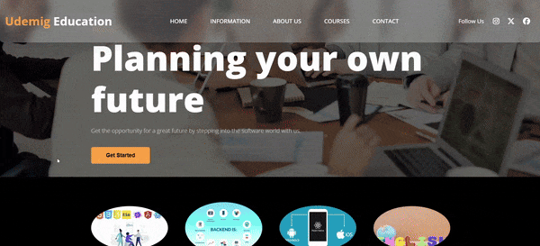

# Udemig Education

Bu projem, bir yazılım akademisinin modern ve kullanıcı dostu web sitesi tasarımını içerir. HTML, SCSS kullanılarak geliştirilmiş; responsive (mobil uyumlu) bir tasarım sunar.

# Özellikler

HTML & SCSS: Temiz ve modüler kod yapısı.

Responsive Tasarım: Tüm cihazlarda uyumlu ve estetik görünüm.

# Ekran Görüntüsü

